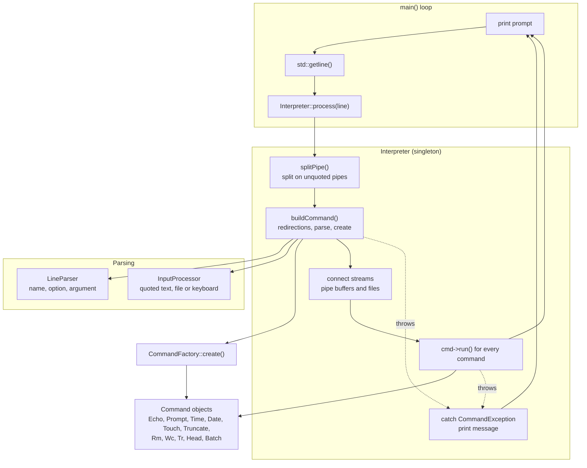
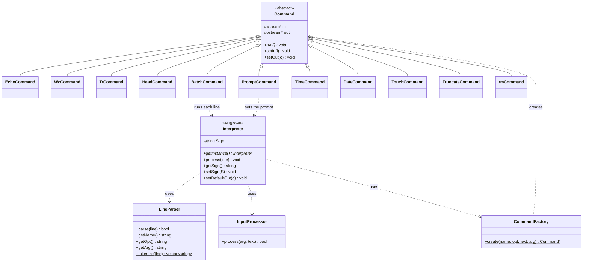
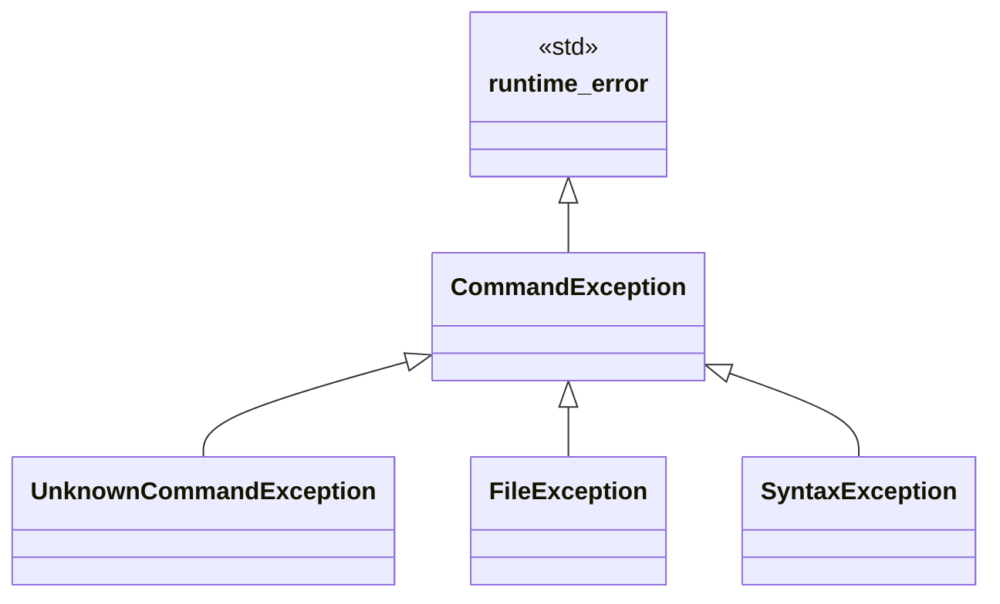

# minishell-cpp

A Unix-style command line interpreter written in C++17 and built around the command pattern. It
has its own line parser, a command factory, exception-based error reporting, and supports
11 built-in commands with input and output redirection, pipes and batch scripts.

```
$ echo "hello world"
hello world
$ echo "one two three" | wc -w
3
$ echo "I love programming in C!" | tr -"C" "C++" > out.txt
```

Built as a course project for Object-Oriented Programming 1 at the School of Electrical
Engineering (ETF), University of Belgrade.

---

## Table of contents

- [Features](#features)
- [Build and run](#build-and-run)
- [Command-line syntax](#command-line-syntax)
- [Architecture](#architecture)
- [How a line is processed](#how-a-line-is-processed)
- [Command reference](#command-reference)
- [Redirection and pipes](#redirection-and-pipes)
- [Error handling](#error-handling)
- [Project layout](#project-layout)
- [Known limitations](#known-limitations)

---

## Features

- **11 built-in commands**: `echo`, `prompt`, `time`, `date`, `touch`, `truncate`, `rm`, `wc`,
  `tr`, `head`, `batch`
- **Output redirection**: `>` (overwrite) and `>>` (append)
- **Input redirection**: `<` reads a file as the command's input
- **Pipes**: `cmd1 | cmd2 | cmd3` passes each command's output to the next one
- **Batch mode**: `batch script.txt` runs a file of commands, and its output can be redirected
- **Three input sources** for text commands: quoted text, a file, or the keyboard
- **Typed exceptions**: unknown commands, file problems and syntax problems are separate classes
  derived from `CommandException`
- **Configurable prompt** through the `prompt` command

---

## Build and run

### Requirements

- A C++17 compiler (GCC, Clang or MSVC)
- CMake **3.10 or newer** (optional, a plain `g++` command works too)

### Build with CMake

```bash
cmake -S . -B build
cmake --build build
./build/cmi
```

### Build with g++

```bash
g++ -std=c++17 -Iinclude -Iinclude/Commands main.cpp src/*.cpp src/commands/*.cpp -o cmi
./cmi
```

The interpreter starts with the prompt `$` and reads one command line at a time.

> **Note:** there is no `exit` command. Close the interpreter with `Ctrl+C`.
> See [Known limitations](#known-limitations).

---

## Command-line syntax

The general form of a command line is:

```
command [-option] [argument] [< infile] [> outfile | >> outfile]
```

Several commands can be chained with `|`:

```
command1 [...] | command2 [...] | command3 [...] [> outfile]
```

`LineParser` splits a command into three parts: the **name**, an **option** (a token that starts
with `-`) and an **argument** (everything else). Quoted text is never split, so `|`, `<` and `>`
inside double quotes are ordinary characters.

### Input sources

Commands that work on text (`echo`, `wc`, `tr`, `head`) get their input from one of these:

| Argument | Input text | Example |
|----------|------------|---------|
| Quoted string | the text between the quotes | `echo "hello world"` |
| Unquoted name | the contents of that file | `echo data.txt` |
| `< file` | the contents of that file | `echo < data.txt` |
| Previous command | the output of the command before the `\|` | `echo "a b" \| wc -w` |
| None | text typed on the keyboard until end of input | `echo` |

Giving both an argument and `< file` is an error.

---

## Architecture

`Interpreter` is the central class. It receives a whole line, splits it into pipeline segments,
asks `LineParser` and `InputProcessor` to prepare each one, and lets `CommandFactory` create the
right `Command` object. Every command reads from an input stream and writes to an output stream,
so pipes and file redirection are just different streams plugged into the same `run()` method.



### Command pattern

Every command derives from the abstract `Command` class, which owns an input stream and an output
stream (`std::cin` and `std::cout` by default). The interpreter replaces them with a
`std::stringstream` for a pipe or an `std::ofstream` for a redirection before calling `run()`.



---

## How a line is processed

1. `main` prints the prompt and reads a line. Empty lines are skipped.
2. `Interpreter::process` cuts the line to 512 characters and splits it on every `|` that is not
   inside quotes.
3. For each segment, `buildCommand` finds the redirections (`>>`, `>`, `<`) outside quotes and
   removes them from the segment.
4. `LineParser` splits what is left into name, option and argument.
5. For `echo`, `wc`, `tr` and `head`, `InputProcessor` turns the argument into the input text (quoted
   text, file contents or keyboard input). A piped command takes its input from the previous
   command instead.
6. `CommandFactory` creates the command object, or the interpreter throws
   `UnknownCommandException`.
7. The interpreter connects the streams: a `std::stringstream` between two commands of a pipe,
   or an `std::ofstream` for `>` and `>>`.
8. Every command's `run()` is called in order, then all objects and streams are released.
9. A `CommandException` thrown anywhere in this process is caught in `process`, printed to
   standard error, and the loop goes on with the next line.

---

## Command reference

| Command | Option | Argument | Description |
|---------|--------|----------|-------------|
| `echo` | | `["text" \| file]` | Prints the input text |
| `prompt` | | `"text"` | Changes the prompt |
| `time` | | | Prints the current time as `HH:MM:SS` |
| `date` | | | Prints the current date as `D.M.YYYY.` |
| `touch` | | `file` | Creates an empty file; fails if it exists |
| `truncate` | | `file` | Deletes the contents of an existing file |
| `rm` | | `file` | Deletes a file |
| `wc` | `-w` or `-c` (required) | `["text" \| file]` | Counts words (`-w`) or characters (`-c`) |
| `tr` | | `["text" \| file] -"what" ["with"]` | Replaces every `what` with `with`, or removes it if `with` is missing |
| `head` | `-nN` (required) | `["text" \| file]` | Prints the first `N` lines of its input (up to 5 digits) |
| `batch` | | `file` | Runs every line of the file as a command |

### Examples

```bash
# echo: quoted text, a file, or the keyboard
$ echo "hello world"
hello world
$ echo data.txt              # prints the file
$ echo < data.txt            # same, through input redirection

# prompt: change the prompt
$ prompt "mysh>"
mysh>

# time and date
$ time
22:02:27
$ date
20.9.2026.

# wc: count words or characters
$ wc -w "one two three"
3
$ wc -c "abcd"
4

# tr: replace, or delete when the second string is missing
$ tr "hello world" -"o" "0"
hell0 w0rld
$ tr "hello world" -"o"
hell wrld

# file management
$ touch made.txt
$ truncate made.txt
$ rm made.txt

# batch: run a script
$ batch script.txt
$ batch script.txt > log.txt     # everything the script prints goes to log.txt
```

### Reading from the keyboard

`echo`, `wc`, `tr` and `head` read from the keyboard when they get no argument. Finish the input with
`Ctrl+Z` (Windows) or `Ctrl+D` (Unix):

```
$ echo
these lines are
collected until EOF
^Z
these lines are
collected until EOF
```

---

## Redirection and pipes

### Output redirection

```bash
$ echo "first" > out.txt       # overwrite
$ echo "second" >> out.txt     # append
```

`echo` writes its text to a file without a trailing newline, and `>>` continues right after the
existing text, so `out.txt` above contains `firstsecond`. On the console `echo` adds a newline
after its output.

### Input redirection

`< file` uses the file as the input of `echo`, `wc`, `tr` or `head`:

```bash
$ wc -w < data.txt
```

### Pipes

```bash
$ echo "piped text" | wc -w
2
$ echo "I love programming in C!" | tr -"C" "C++" | wc -c
26
```

Each command writes into a `std::stringstream` that the next command reads from. Some rules are
enforced:

- `time` and `date` have no input, so they can only be the first command of a pipe
- a command in the middle of a pipe cannot redirect its output, and a piped command cannot
  redirect its input
- only the last command of a pipe can write to a file
- an empty part, as in `cmd | | cmd` or a trailing `|`, is a syntax error

### Batch scripts

`batch` reads a file line by line and runs each line through the same `Interpreter::process`.
When `batch` has an output redirect, that file receives the output of every command in the
script.

---

## Error handling

Every failure is a `CommandException`. It is thrown from the parser, the interpreter or a command,
and caught in `Interpreter::process`, which prints the message to standard error. A bad line never
stops the interpreter or a running batch.



### Error messages in practice

```
$ foobar "x"
Unknown command foobar

$ touch a.txt
$ touch a.txt
touch: file already exists a.txt

$ rm nosuchfile.txt
rm: file does not exist nosuchfile.txt

$ wc -x "abc"
wc: unsupported option -x

$ echo "a" < data.txt
echo: cannot use both argument and input redirection

$ echo "a" > x.txt | wc -w
cannot redirect output of piped command

$ echo "a" | | wc -w
invalid pipe syntax

$ time | wc -c
8
$ echo "a" | time
time: cannot be used after pipe
```

---

## Project layout

```
minishell-cpp/
├── CMakeLists.txt
├── main.cpp                     prompt loop
├── include/
│   ├── Command.h                abstract command with input and output streams
│   ├── Interpreter.h            singleton: splitting, wiring and running commands
│   ├── CommandFactory.h         creates a command from its name
│   ├── CommandException.h       exception hierarchy
│   ├── InputProcessor.h         quoted text, file or keyboard input
│   ├── LineParser.h             name, option and argument of a command
│   └── Commands/                one header per command
│       ├── EchoCommand.h   PromptCommand.h   TimeCommand.h   DateCommand.h
│       ├── TouchCommand.h  TruncateCommand.h rmCommand.h     WcCommand.h
│       └── trCommand.h     HeadCommand.h     BatchCommand.h
├── src/
│   ├── Interpreter.cpp  CommandFactory.cpp  InputProcessor.cpp  LineParser.cpp
│   └── commands/                one implementation per command
└── tests/                       sample input files and command scripts
```

### Design notes

- **Command pattern** keeps `Interpreter` free of per-command logic. Adding a command means adding
  a class and one case in `CommandFactory::create`.
- **Streams as the connection point**: a command only knows its `in` and `out` streams, so
  console, file and pipe output all use the same `run()` code.
- **Singleton `Interpreter`** is shared by `main`, `PromptCommand` (which changes the prompt) and
  `BatchCommand` (which runs lines through the same interpreter).
- **Exception hierarchy** lets `process` catch one base class while the message identifies the
  kind of failure.

---

## Known limitations

- **No exit command.** The loop never ends; close the program with `Ctrl+C`.
- **Lines longer than 512 characters are silently cut.**
- **Error messages go to standard error**, so they are not written to a file by `>` or by a
  redirected `batch`.
